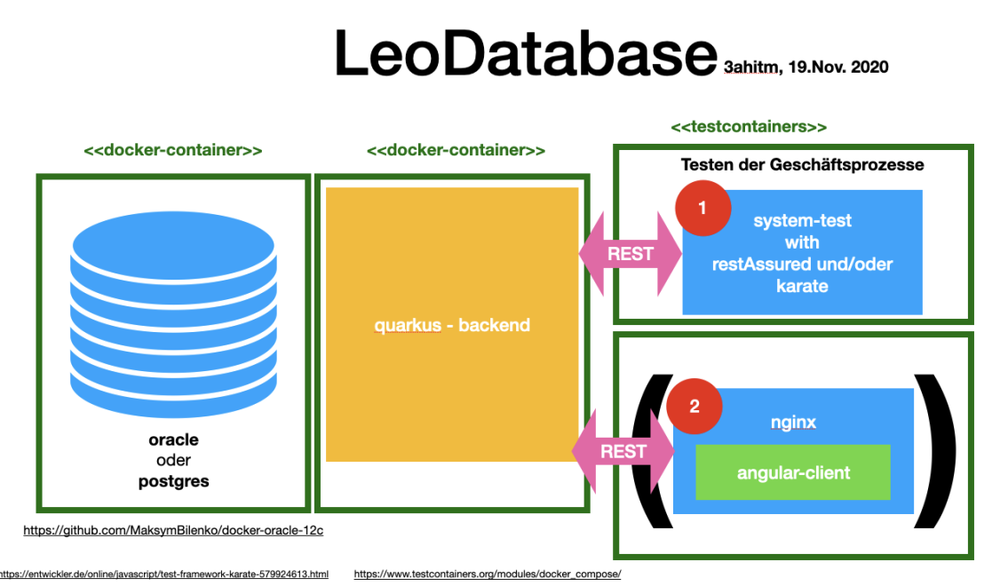
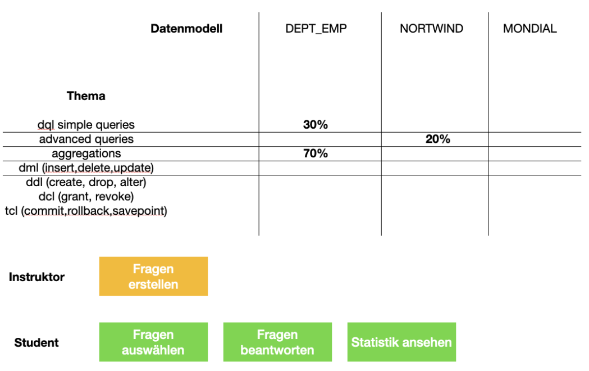
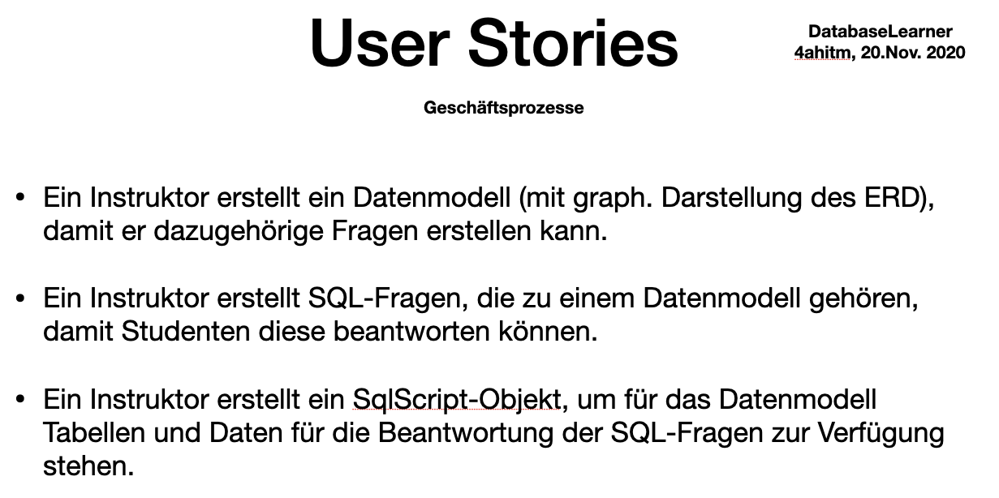
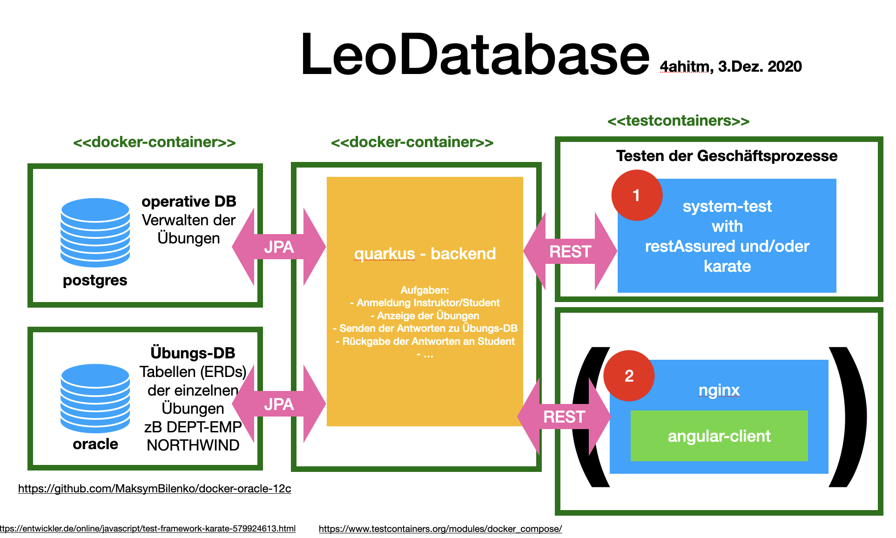

= LeoDatabaseLearner - Information from teachers
19SM, 22TI, 15PV
1.0.0, 2020-12-03: Some notes
ifndef::imagesdir[:imagesdir: images]
//:toc-placement!:  // prevents the generation of the doc at this position, so it can be printed afterwards
:sourcedir: ../src/main/java
:icons: font
:sectnums:    // Nummerierung der Überschriften / section numbering
:toc: left

//Need this blank line after ifdef, don't know why...
ifdef::backend-html5[]

[20112020_01, png]
:imagesdir:

---
[20112020_02, png]
:imagesdir:

---
[20112020_03, png]
:imagesdir:

---
[20112020_04, png]
:imagesdir:

---
[20112020_05, png]
:imagesdir:

